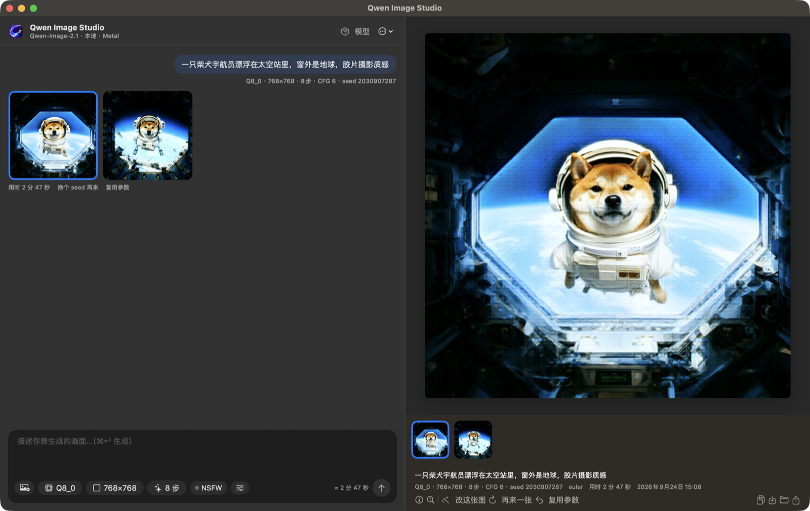

<p align="center">
  
</p>

<h1 align="center">Qwen Image Studio</h1>

<p align="center">
  在 Mac 上本地运行 <b>Qwen-Image-2.1</b> 的原生生图 / 改图 app<br>
  SwiftUI · stable-diffusion.cpp · Metal · Unsloth GGUF
</p>

<p align="center">
  <a href="../../releases/latest"><b>⬇️ macOS 版（DMG）</b></a>
  &nbsp;·&nbsp;
  <a href="../../releases/latest"><b>⬇️ Windows 版（绿色版 zip）</b></a>
</p>



## 功能

- **对话式生图**：左边写提示词，右边看大图。生成过程中有实时预览、进度和剩余时间，可以排队连续生成
- **接着改**：生成后直接说「背景换成雪山」「让它戴墨镜」，会以当前图片为底图继续修改，也能回到任意历史版本重新分支
- **官方提示词改写**（可选，需要 [Ollama](https://ollama.com)）：在 app 里一键安装 Qwen 官方为 2.1 训练的改写模型 [PE-T2I / PE-I2I](https://github.com/QwenLM/Qwen-Image-2.1#prompt-rewriting)（社区 GGUF 版）。文生图时把一句话扩写成详细的画面描述，并自动选择画面比例；改图时模型能**看到上一张图**，再写出准确的编辑指令。没装官方模型时，可以用任意 Ollama 通用模型代替
- **透明背景 PNG**：套用官方的 RGBA 提示词格式，输出带透明通道的图，适合做贴纸、图标
- **去除 VAE 网格**：Qwen-Image 的 VAE 会留下很淡的 2px 网格，出图后自动精确去除（平坦区域的网格强度降低约 90%）
- **参考图改图**：拖入最多 10 张参考图
- **模型管理**：一键下载或切换 Unsloth 提供的各档量化版本（Q2~Q8、F16），首次启动时按内存自动推荐
- **完整参数**：
  - 分辨率三档（草稿 / 标准 / 2K），7 种画面比例
  - 画质预设，对应不同的采样步数
  - CFG、采样器、调度器、seed、一次生成多张、负面提示词
  - NSFW 开关
  - EasyCache 加速、VAE 分块解码
- 回车发送，Shift+回车换行（兼容中文输入法）

## 系统要求

- Apple 芯片的 Mac（M1 及以后），macOS 14+
- 内存 16GB 起步，32GB 以上体验更好
- 约 15GB 硬盘空间用于存放模型

参考速度（M5 Pro，Q8_0，1024×1024，20 步，CFG 6）：约 18 秒/步，一张图约 6 分钟。

## 安装

1. 从 [Releases](../../releases/latest) 下载 DMG，把 app 拖进「应用程序」
2. app 没有经过苹果公证，第一次打开会被拦下：到「系统设置 → 隐私与安全性」里点「仍要打开」，或者在终端执行：
   ```bash
   xattr -dr com.apple.quarantine "/Applications/Qwen Image Studio.app"
   ```
3. 首次启动后点「一键下载」模型（来自 Hugging Face）

## Windows 版

[`windows/`](windows/) 目录是 Windows 10/11 版本（Qt for Python + stable-diffusion.cpp），支持 NVIDIA（CUDA）、AMD / Intel（Vulkan）和 CPU 三种推理后端。

1. 从 [Releases](../../releases/latest) 下载 `Qwen-Image-Studio-Windows-<版本>-portable.zip` 并解压
2. 在解压出的文件夹里打开 PowerShell，下载推理引擎（AMD / Intel 显卡把 `CUDA` 换成 `Vulkan`）：
   ```powershell
   powershell -ExecutionPolicy Bypass -File .\scripts\download-engine.ps1 -Backend CUDA
   ```
3. 启动 `Qwen Image Studio.exe`，点「模型」→「一键安装推荐组合」

功能与 macOS 版一致（包括官方提示词改写、VAE 去网格、接着改）。详见 [windows/README.md](windows/README.md)。

## 从源码构建

需要 Xcode 16+（Swift 5.10+）和 CMake：

```bash
cd app
./build.sh          # 首次会自动从源码编译 stable-diffusion.cpp 推理引擎
./make_dmg.sh 1.0   # 打包 DMG 到 dist/
```

目录结构：

```
app/Sources/      SwiftUI 源码
app/build.sh      构建 .app
app/build_engine.sh   编译 sd-cli（最低 macOS 14，静态链接 + 内嵌 Metal shader）
app/make_dmg.sh   打包 DMG
gen.sh            命令行生图脚本（需要把 sd-cli 放在 bin/，模型放在 models/）
```

模型文件（放在工作目录的 `models/` 下，app 可以自动下载）：

| 文件 | 来源 |
|---|---|
| `qwen-image-2.1-Q8_0.gguf` 等去噪模型 | [unsloth/Qwen-Image-2.1-GGUF](https://huggingface.co/unsloth/Qwen-Image-2.1-GGUF) |
| `Qwen3-VL-8B-Instruct-UD-Q4_K_XL.gguf`（文本编码器）、`mmproj-BF16.gguf`（视觉模块，改图用） | [unsloth/Qwen3-VL-8B-Instruct-GGUF](https://huggingface.co/unsloth/Qwen3-VL-8B-Instruct-GGUF) |
| `vae/qwen_image_2.1_vae_bf16.safetensors` | [unsloth/Qwen-Image-2.1-FP8](https://huggingface.co/unsloth/Qwen-Image-2.1-FP8) |

## 致谢

- [Qwen-Image](https://huggingface.co/Qwen)：通义千问团队
- [Unsloth](https://unsloth.ai/docs/models/qwen-image-2.1)：GGUF / FP8 量化
- [stable-diffusion.cpp](https://github.com/leejet/stable-diffusion.cpp) / [ggml](https://github.com/ggml-org/ggml)：推理引擎（MIT）

## 许可

本项目代码使用 [MIT](LICENSE) 许可。模型权重请遵守各自的许可协议。
